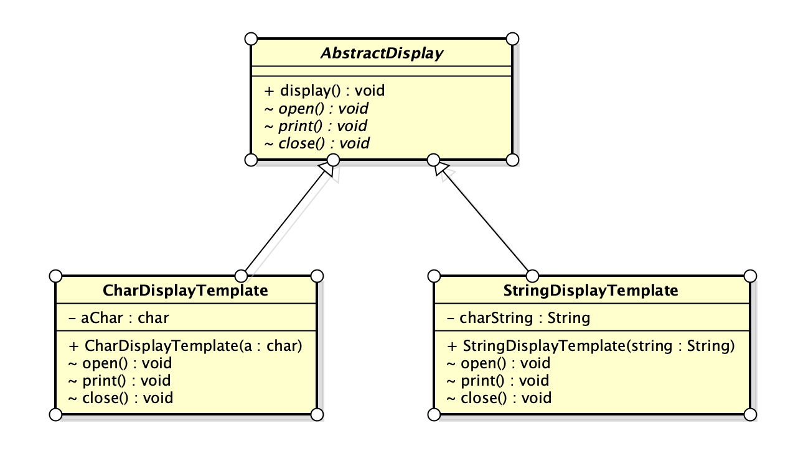

# 3.模板模式
**模板模式：**`是带有模板功能的模式，组成模板的方法被定义在父类中，由于这些方法是抽像的，所以在父类代码中无法知道具体实现，唯一能知道的是父类在如何调用这些方法，具体的实现全由子类方法处理。`

#### ①.UML图

#### ②.代码清单
#### ③.思路分析
+ 逻辑处理通用化

`由于在父类模板方法中编写了算法，无需在子类中在编写算法。当发现模板方法中存在Bug，仅需要改动模板方法即可解决问题。并非像传统编码方式上的修改所有ConcreteClass角色类的相关逻辑代码。`
+ 父、子类间的协作性

`子类实现父类抽象方法时，必须理解这些抽象方法被调用的时机、逻辑。如果看不到父类代码，不能了解到父类方法中所定义的相关逻辑，想要编写子类抽象方法实现代码是很困难的。`
+ 父、子类间的一致性

`通过父类类型定义子类实例变量，即时不使用instanceof指定子类的类型，程序依然可以正常运行。`***(里氏替换原则[LSP],通用的继承原则。)***
#### ④.类的层次与抽象类
+ 父类对子类的约束
    + 在子类中可以使用父类中定义的方法
    + 可以通过在子类中增加方法的形式实现新功能
    + 在子类中重写父类方法可以改变程序的行为
    + 期待子类实现抽象方法
    + 要求子类实现抽象方法
+ 抽象类

`在模板方法中：抽象方法并不会有具体的实现代码，仅仅是确立了抽象方法的名称，通过调用使用了抽象方法的模板方法去实现编写实现。抽象类确立了实现的流程，子类决定了流程中具体要处理的内容。`